# NL-P5 Tier Catalog — Batch 1

Owner review per the named-layouts spec §2.3: each widget, each supported
tier, judged as a designed composition under the no-whitespace law. Docked
lines are one dense text-first row (middle dots separate facts). Captures
were taken from the production preview build at 1600x900 with seeded data.

Batch-1 notes for the review:
- Timer/Tasks/Notes Docked lines are their existing dense launcher chips, declared rather than rebuilt.
- Bookmarks Docked is the full readable bar (spec exemption).
- Focus Docked is its existing single-line form rendered in the strip.
- greeting, search, and quote declare NO Docked tier in batch 1 (no honest one-line dock form); overrule here if wanted.
- The docked Weather line omits the free chip's staleness/offline feedback text (a one-dense-line tradeoff); a stale cache reads like a fresh one in the strip. Owner call: accept, or add a muted staleness marker.

## Clock

| Tier | Content contract | Capture | Owner verdict |
| --- | --- | --- | --- |
| compact | Current time | 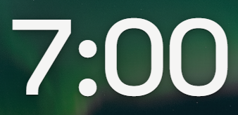 | _pending_ |
| standard | Time and date | 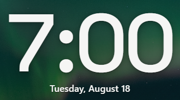 | _pending_ |
| full | Large, legible time and date _Currently renders identically to standard — tier differentiation pending owner direction_ |  | _pending_ |
| docked | Time · date | 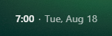 | _pending_ |

## Greeting

| Tier | Content contract | Capture | Owner verdict |
| --- | --- | --- | --- |
| compact | Greeting |  | _pending_ |
| standard | More legible greeting _Currently renders identically to compact — tier differentiation pending owner direction_ |  | _pending_ |

## Search

| Tier | Content contract | Capture | Owner verdict |
| --- | --- | --- | --- |
| compact | Search action |  | _pending_ |
| standard | More legible search action _Currently renders identically to compact — tier differentiation pending owner direction_ |  | _pending_ |

## Focus

| Tier | Content contract | Capture | Owner verdict |
| --- | --- | --- | --- |
| compact | Focus action |  | _pending_ |
| standard | Focus detail _Currently renders identically to compact — tier differentiation pending owner direction_ | 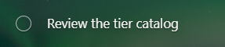 | _pending_ |
| docked | Focus text and completion |  | _pending_ |

## Quote

| Tier | Content contract | Capture | Owner verdict |
| --- | --- | --- | --- |
| compact | Quote |  | _pending_ |
| standard | Readable full quote |  | _pending_ |

## Weather

| Tier | Content contract | Capture | Owner verdict |
| --- | --- | --- | --- |
| compact | Current temperature and condition | 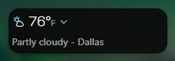 | _pending_ |
| standard | Forecast context | 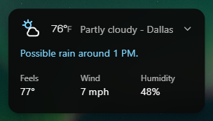 | _pending_ |
| full | Detailed forecast | 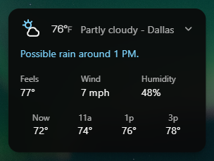 | _pending_ |
| docked | Temperature · location · condition | 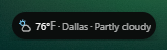 | _pending_ |

## Timer

| Tier | Content contract | Capture | Owner verdict |
| --- | --- | --- | --- |
| compact | Timer action | 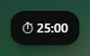 | _pending_ |
| docked | Timer state | 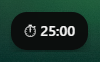 | _pending_ |

## Tasks

| Tier | Content contract | Capture | Owner verdict |
| --- | --- | --- | --- |
| compact | Tasks action | 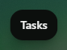 | _pending_ |
| docked | Tasks action | 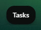 | _pending_ |

## Notes

| Tier | Content contract | Capture | Owner verdict |
| --- | --- | --- | --- |
| compact | Notes action | 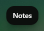 | _pending_ |
| docked | Notes action | 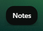 | _pending_ |

## Bookmarks

| Tier | Content contract | Capture | Owner verdict |
| --- | --- | --- | --- |
| compact | Bookmark marks | 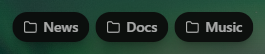 | _pending_ |
| standard | Named bookmark bar _Currently renders identically to compact (spec exemption: the full readable bar at every tier)_ |  | _pending_ |
| docked | Full readable bookmark bar | 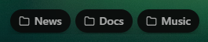 | _pending_ |
