# NL-P5 Tier Catalog — Batch 2

Owner review per the named-layouts spec §2.3: the nine connector widgets
plus the remaining small widgets, each at every supported tier. Docked
lines are one dense text-first row (middle dots separate facts), built
from the SAME snapshot each widget already renders — no second fetch.
Captures were taken from the production preview build at 1600x900 with
the authoritative nine-connector fixture data.

Batch-2 notes for the review:
- Connector dock lines are non-interactive readouts: their free forms offer no panel or expansion, so a readout IS click parity (spec 2.4). Overrule here if a docked connector should open something.
- worldClocks, countdown, sun, and moon declare Docked with their existing compact single-line compositions (declared, not rebuilt); judge them in the strip captures.
- monthCal and links declare NO Docked tier (a month grid and a launcher grid have no honest one-line form); overrule here if wanted.
- The GitHub line follows the spec's own example shape (PRs · issues · unread). Quiet states read "All clear".

## GitHub

| Tier | Content contract | Capture | Owner verdict |
| --- | --- | --- | --- |
| compact | Selected primary count or graph | 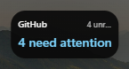 | _pending_ |
| standard | Selected graph or rows | 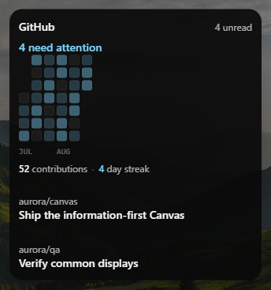 | _pending_ |
| full | Graph, stats, and all selected row families | 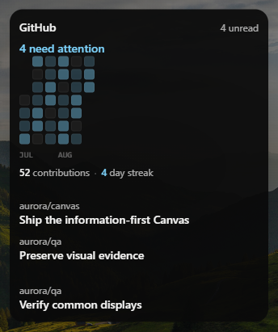 | _pending_ |
| docked | Selected activity counts | 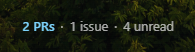 | _pending_ |

## GitLab

| Tier | Content contract | Capture | Owner verdict |
| --- | --- | --- | --- |
| compact | Selected primary count or graph | 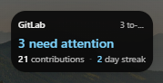 | _pending_ |
| standard | Selected graph or rows | 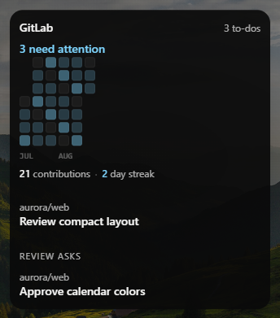 | _pending_ |
| full | All selected GitLab sections | 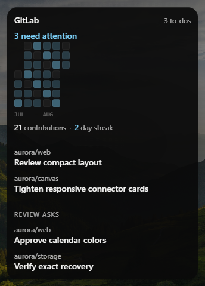 | _pending_ |
| docked | Selected activity counts | 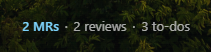 | _pending_ |

## Jira

| Tier | Content contract | Capture | Owner verdict |
| --- | --- | --- | --- |
| compact | Selected-view count | 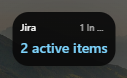 | _pending_ |
| standard | Prioritized issue rows | 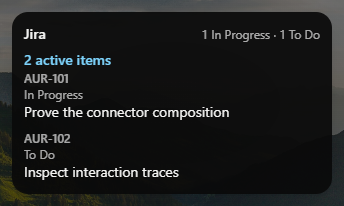 | _pending_ |
| full | All selected Jira sections | 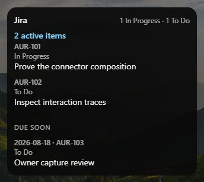 | _pending_ |
| docked | Selected issue counts | 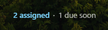 | _pending_ |

## Vercel

| Tier | Content contract | Capture | Owner verdict |
| --- | --- | --- | --- |
| compact | Deployment health | 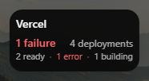 | _pending_ |
| standard | Selected deployment rows or summary | 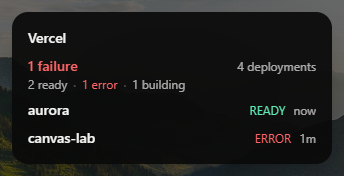 | _pending_ |
| full | All selected deployment sections | 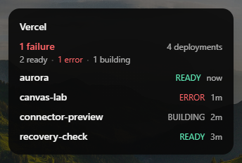 | _pending_ |
| docked | Deployment health | 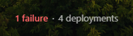 | _pending_ |

## Status

| Tier | Content contract | Capture | Owner verdict |
| --- | --- | --- | --- |
| compact | Service health | 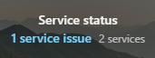 | _pending_ |
| standard | Service dots and active issues | 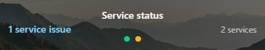 | _pending_ |
| docked | Service health |  | _pending_ |

## Headlines

| Tier | Content contract | Capture | Owner verdict |
| --- | --- | --- | --- |
| compact | Top headline | 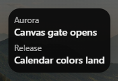 | _pending_ |
| standard | Selected headlines | 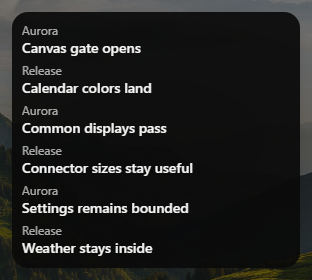 | _pending_ |
| full | All selected headlines that fit | 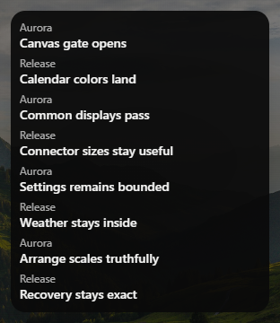 | _pending_ |
| docked | Top headline |  | _pending_ |

## Crypto

| Tier | Content contract | Capture | Owner verdict |
| --- | --- | --- | --- |
| compact | Primary coin price | 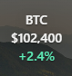 | _pending_ |
| standard | Selected coin prices | 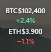 | _pending_ |
| docked | Primary coin price | 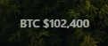 | _pending_ |

## Home Assistant

| Tier | Content contract | Capture | Owner verdict |
| --- | --- | --- | --- |
| compact | Selected entity or action | 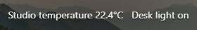 | _pending_ |
| standard | Selected entities and actions | 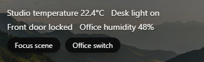 | _pending_ |
| full | Complete selected home composition | 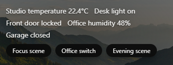 | _pending_ |
| docked | Selected entity state | 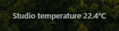 | _pending_ |

## Calendar

| Tier | Content contract | Capture | Owner verdict |
| --- | --- | --- | --- |
| compact | Next event | 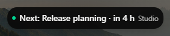 | _pending_ |
| standard | Selected calendar view | 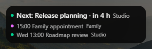 | _pending_ |
| docked | Next event | 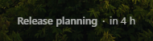 | _pending_ |

## Habits

| Tier | Content contract | Capture | Owner verdict |
| --- | --- | --- | --- |
| compact | Habit action | 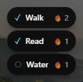 | _pending_ |
| docked | Habits done today | 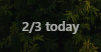 | _pending_ |

## World clocks

| Tier | Content contract | Capture | Owner verdict |
| --- | --- | --- | --- |
| compact | Primary world clock | 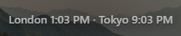 | _pending_ |
| standard | Selected clocks _Currently renders identically to compact — tier differentiation pending owner direction_ |  | _pending_ |
| full | All selected clocks _Currently renders identically to compact — tier differentiation pending owner direction_ |  | _pending_ |
| docked | Primary world clock | 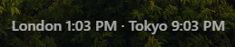 | _pending_ |

## Countdown

| Tier | Content contract | Capture | Owner verdict |
| --- | --- | --- | --- |
| compact | Countdown |  | _pending_ |
| standard | Countdown detail _Currently renders identically to compact — tier differentiation pending owner direction_ | 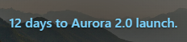 | _pending_ |
| docked | Next countdown | 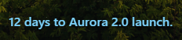 | _pending_ |

## Sun

| Tier | Content contract | Capture | Owner verdict |
| --- | --- | --- | --- |
| compact | Next sun event | 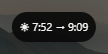 | _pending_ |
| standard | Sunrise and sunset | 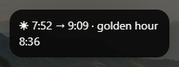 | _pending_ |
| docked | Next sun event | 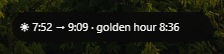 | _pending_ |

## Moon

| Tier | Content contract | Capture | Owner verdict |
| --- | --- | --- | --- |
| compact | Current phase | 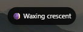 | _pending_ |
| docked | Current phase | 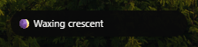 | _pending_ |

## Month

| Tier | Content contract | Capture | Owner verdict |
| --- | --- | --- | --- |
| compact | Current week | 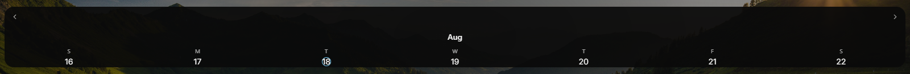 | _pending_ |
| standard | Complete month | 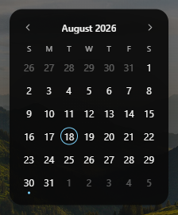 | _pending_ |

## Quick Links

| Tier | Content contract | Capture | Owner verdict |
| --- | --- | --- | --- |
| compact | Primary link action | 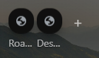 | _pending_ |
| standard | Selected quick links _Currently renders identically to compact — tier differentiation pending owner direction_ |  | _pending_ |
