# SF-P1 Shared Frame Owner Catalog

- Preliminary build commit: `701afea0fe42b9a8cfeae280179c13b8faa9fed3`
- Build provenance: `701afea0fe42b9a8cfeae280179c13b8faa9fed3`
- Browser: chromium 151.0.7922.34; Playwright Chromium; DPR 1; reduced motion
- Original-resolution captures: 28
- Verdicts: 28 Useful, 0 Needs refinement, 0 Rejected
- Verdicts are explicit per image and are not calculated from assertion status.
- Original-resolution inspection: all 28 PNGs opened individually; the explicit row verdicts below were retained after pixel review. The final rerun produced identical SHA-256 hashes for all 28 files.

| Original PNG | Subject | Tier / state | Theme | Viewport | Measured frame and content geometry | Visible essential content | Visible signature content | Minimum text / focus | Selected text | Runtime storage writes | Usefulness verdict |
| --- | --- | --- | --- | --- | --- | --- | --- | --- | --- | --- | --- |
| 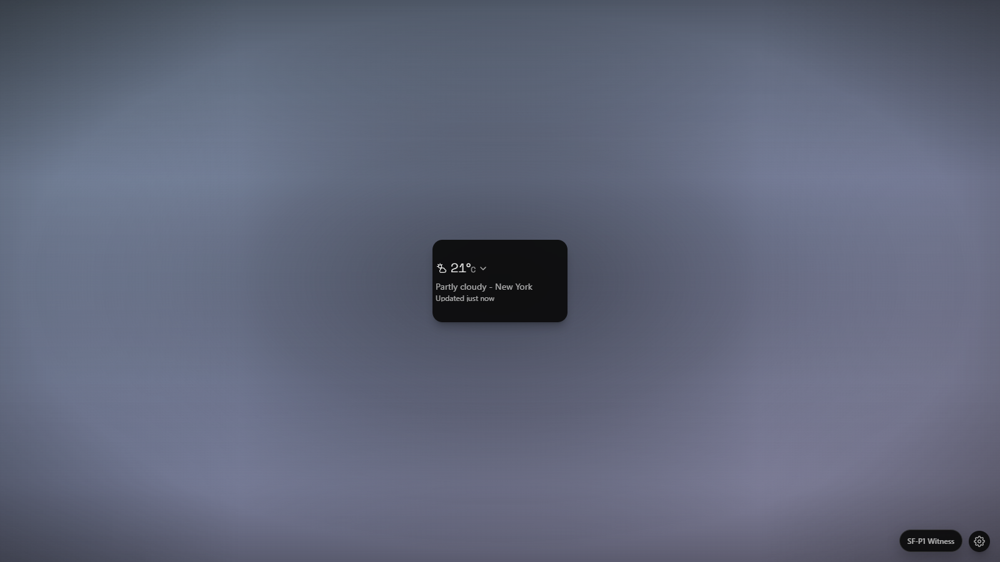 | weather / free-tier | compact / ready | dark | 1600x900 | 216.00x132.00 CSS px; client 214x130; scroll 214x130; overflow hidden/hidden | 21° C / Partly cloudy - New York | 21° C Partly cloudy - New York | 12px / Visible (21°CPartly cloudy - New York) | None | None | **Useful**: The compact weather reference composition is legible, materially distinct, and bounded at its declared frame. |
| 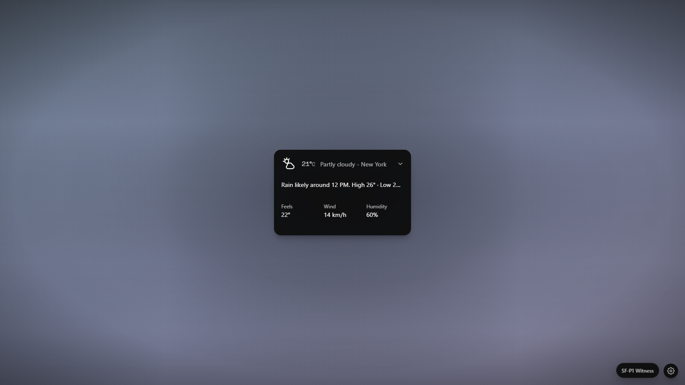 | weather / free-tier | standard / ready | dark | 1600x900 | 320.00x200.00 CSS px; client 318x198; scroll 318x198; overflow hidden/hidden | 21° C / Partly cloudy - New York | Rain likely around 12 PM. | 12px / Visible (21°CPartly cloudy - New YorkRain likely around 12 PM.Feels22°Wind14 km/hHumidity60%) | None | None | **Useful**: The standard weather reference composition is legible, materially distinct, and bounded at its declared frame. |
| 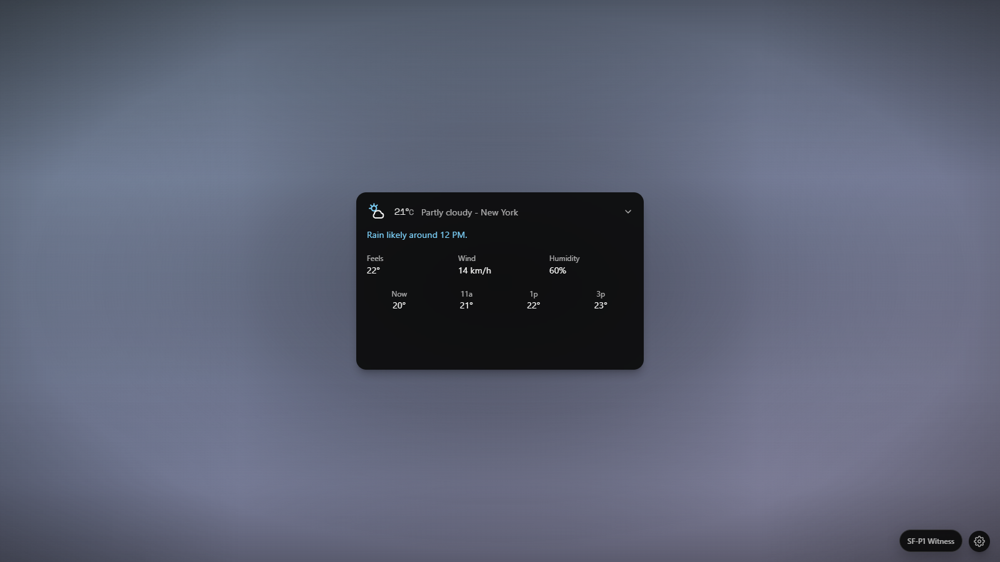 | weather / free-tier | full / ready | dark | 1600x900 | 460.00x284.00 CSS px; client 458x282; scroll 458x282; overflow hidden/hidden | 21° C / Partly cloudy - New York | Now 20° 11a 21° 1p 22° 3p 23° | 12px / Visible (21°CPartly cloudy - New YorkRain likely around 12 PM.Feels22°Wind14 km/hHumidity60%Now20°11a21°1p22°3p23°) | None | None | **Useful**: The full weather reference composition is legible, materially distinct, and bounded at its declared frame. |
|  | weather / state | standard / loading | dark | 1366x768 | 320.00x200.00 CSS px; client 318x198; scroll 318x198; overflow hidden/hidden | Loading weather… / Loading weather… | State: loading | 14px / N/A: no focusable control in this state | None | None | **Useful**: The truthful weather loading presentation remains readable and stable inside the selected standard frame. |
| 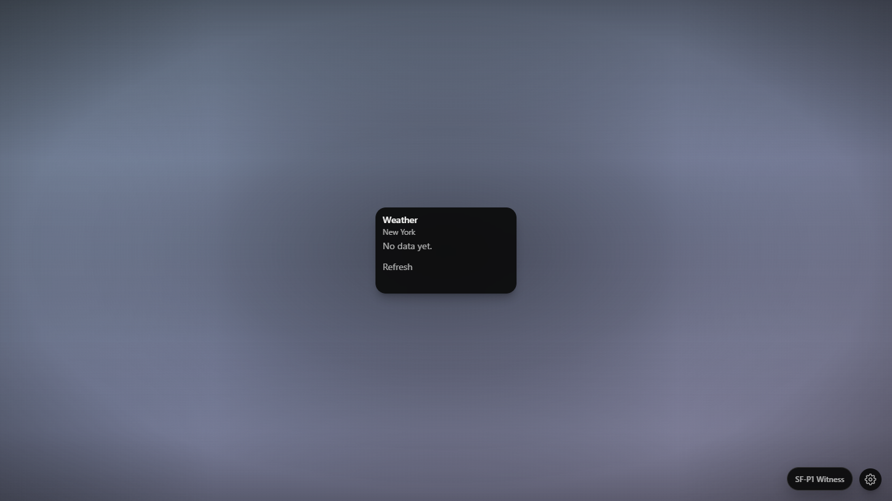 | weather / state | compact / empty | dark | 1366x768 | 216.00x132.00 CSS px; client 214x130; scroll 214x130; overflow hidden/hidden | No data yet. | State: empty | 14px / N/A: no focusable control in this state | None | None | **Useful**: The truthful weather empty presentation remains readable and stable inside the selected compact frame. |
| 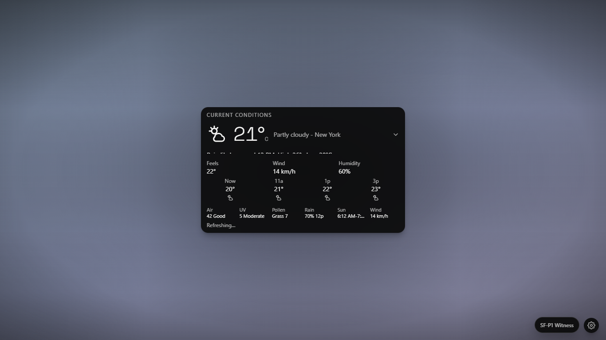 | weather / state | full / stale | dark | 1366x768 | 460.00x284.00 CSS px; client 458x282; scroll 458x282; overflow hidden/hidden | Refreshing… | State: stale | 12px / Visible (21°CPartly cloudy - New YorkRain likely around 12 PM.Feels22°Wind14 km/hHumidity60%Now20°11a21°1p22°3p23°Refreshing…) | None | None | **Useful**: The truthful weather stale presentation remains readable and stable inside the selected full frame. |
| 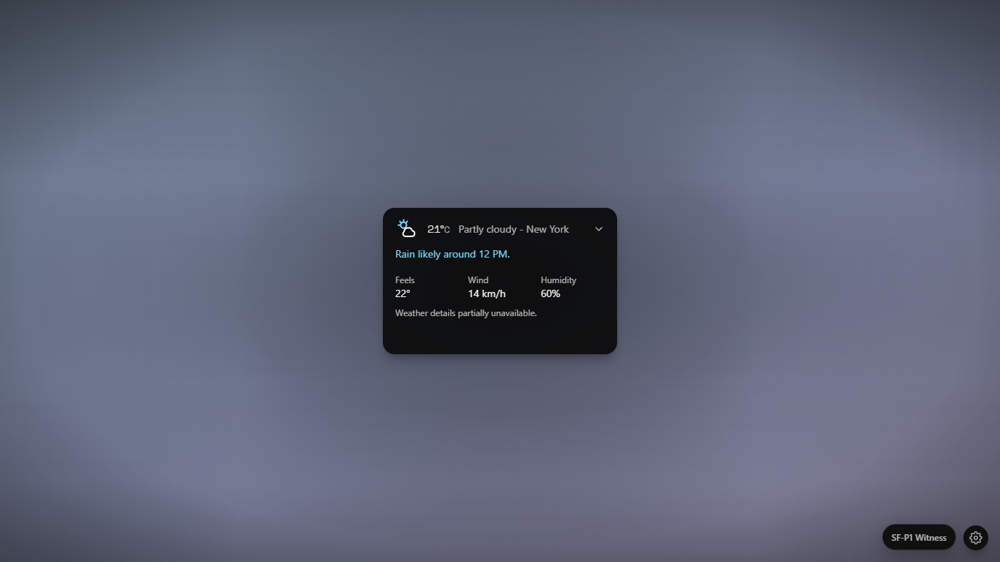 | weather / state | standard / partial | dark | 1366x768 | 320.00x200.00 CSS px; client 318x198; scroll 318x198; overflow hidden/hidden | Weather details partially unavailable. | State: partial | 12px / Visible (21°CPartly cloudy - New YorkRain likely around 12 PM.Feels22°Wind14 km/hHumidity60%Weather details partially unavailable.) | None | None | **Useful**: The truthful weather partial presentation remains readable and stable inside the selected standard frame. |
| 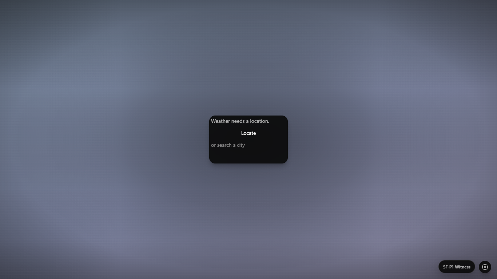 | weather / state | compact / permission-required | dark | 1366x768 | 216.00x132.00 CSS px; client 214x130; scroll 214x130; overflow hidden/hidden | Weather needs a location. Locate | State: permission-required | 14px / Visible (Use my location) | None | None | **Useful**: The truthful weather permission-required presentation remains readable and stable inside the selected compact frame. |
|  | weather / state | compact / hard-error | dark | 1366x768 | 216.00x132.00 CSS px; client 214x130; scroll 214x130; overflow hidden/hidden | Weather unavailable. Try again. Refresh / Weather unavailable. Try again. | State: hard-error | 14px / Visible (Refresh) | None | None | **Useful**: The truthful weather hard-error presentation remains readable and stable inside the selected compact frame. |
| 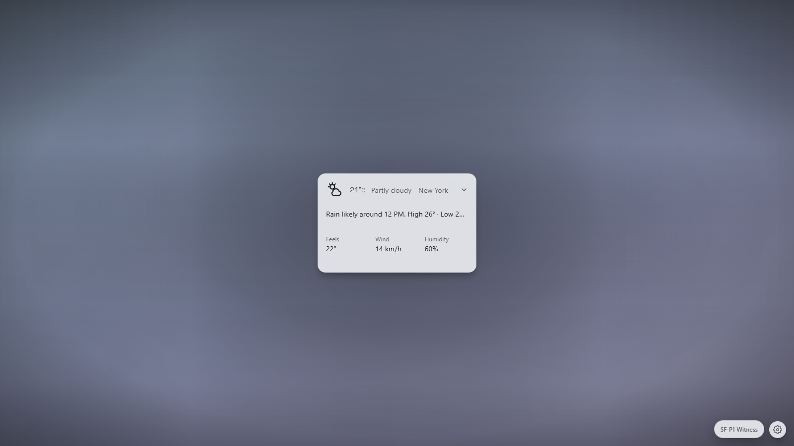 | weather / theme | standard / ready | light | 1600x900 | 320.00x200.00 CSS px; client 318x198; scroll 318x198; overflow hidden/hidden | 21° C / Partly cloudy - New York | Rain likely around 12 PM. | 12px / Visible (21°CPartly cloudy - New YorkRain likely around 12 PM.Feels22°Wind14 km/hHumidity60%) | None | None | **Useful**: The weather Standard hierarchy and keyboard focus treatment remain clear on the light panel. |
| 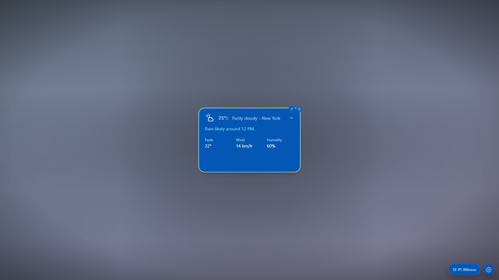 | weather / theme | standard / ready | saturated | 1600x900 | 320.00x200.00 CSS px; client 318x198; scroll 318x198; overflow hidden/hidden | 21° C / Partly cloudy - New York | Rain likely around 12 PM. | 12px / Visible (21°CPartly cloudy - New YorkRain likely around 12 PM.Feels22°Wind14 km/hHumidity60%) | None | None | **Useful**: The weather Standard hierarchy and keyboard focus treatment remain clear on the saturated panel. |
| 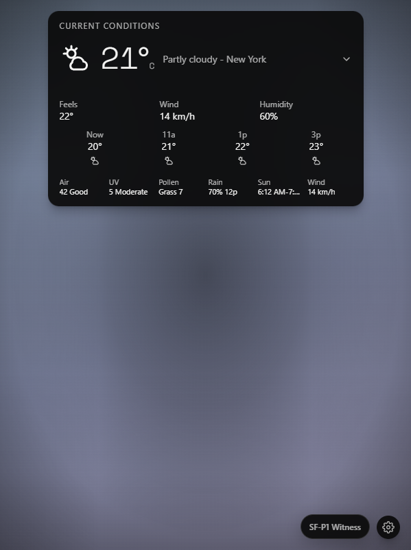 | weather / narrow | full / ready | dark | 599x800 | 460.00x284.00 CSS px; client 458x282; scroll 458x282; overflow hidden/hidden | 21° C / Partly cloudy - New York | Now 20° 11a 21° 1p 22° 3p 23° | 12px / Visible (21°CPartly cloudy - New YorkRain likely around 12 PM.Feels22°Wind14 km/hHumidity60%Now20°11a21°1p22°3p23°) | None | None | **Useful**: The weather Full frame remains exact, readable, and contained at the 599px narrow-floor boundary. |
|  | onThisDay / free-tier | compact / ready | dark | 1600x900 | 216.00x132.00 CSS px; client 214x130; scroll 214x130; overflow hidden/hidden | On This Day / August 22 / 1800 Aurora history witness event 1 with a bounded, readable historical summary for the shared-frame witness. | 1800 Aurora history witness event 1 with a bounded, readable historical summary for the shared-frame witness. | 12px / Visible (Aurora history witness event 1 with a bounded, readable historical summary for the shared-frame witness.) | None | None | **Useful**: The compact onThisDay reference composition is legible, materially distinct, and bounded at its declared frame. |
| 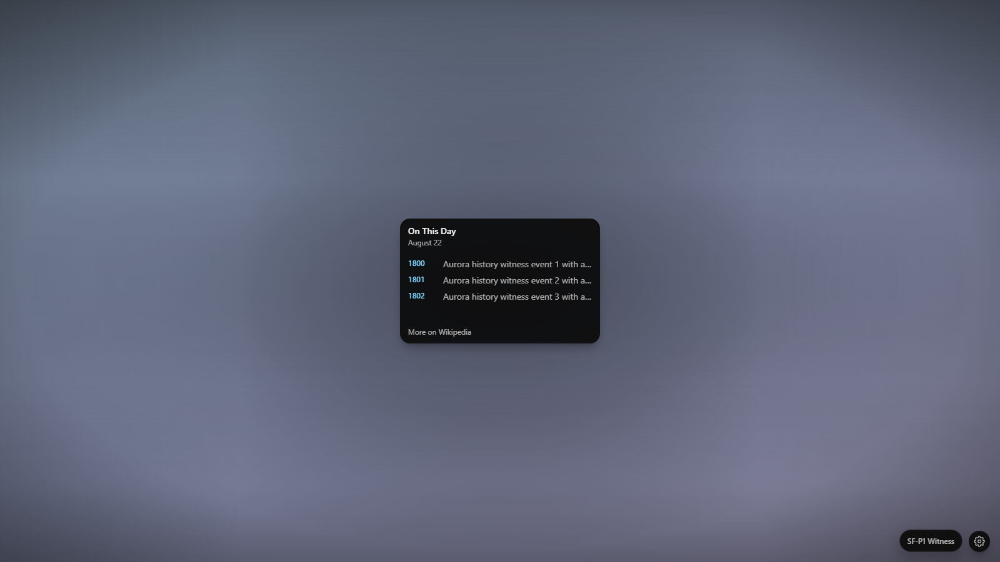 | onThisDay / free-tier | standard / ready | dark | 1600x900 | 320.00x200.00 CSS px; client 318x198; scroll 318x198; overflow hidden/hidden | On This Day / August 22 / 1800 Aurora history witness event 1 with a bounded, readable historical summary for the shared-frame witness. / 1801 Aurora history witness event 2 with a bounded, readable historical summary for the shared-frame witness. / 1802 Aurora history witness event 3 with a bounded, readable historical summary for the shared-frame witness. | 1800 Aurora history witness event 1 with a bounded, readable historical summary for the shared-frame witness. 1801 Aurora history witness event 2 with a bounded, readable historical summary for the shared-frame witness. 1802 Aurora history witness event 3 with a bounded, readable historical summary for the shared-frame witness. | 12px / Visible (Aurora history witness event 1 with a bounded, readable historical summary for the shared-frame witness.) | None | None | **Useful**: The standard onThisDay reference composition is legible, materially distinct, and bounded at its declared frame. |
| 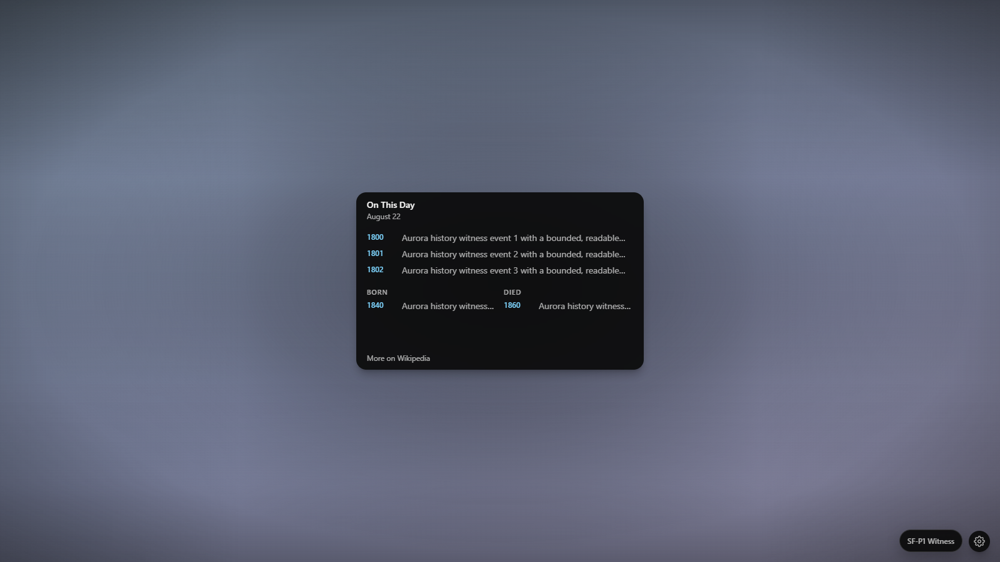 | onThisDay / free-tier | full / ready | dark | 1600x900 | 460.00x284.00 CSS px; client 458x282; scroll 458x282; overflow hidden/hidden | On This Day / August 22 / 1800 Aurora history witness event 1 with a bounded, readable historical summary for the shared-frame witness. / 1801 Aurora history witness event 2 with a bounded, readable historical summary for the shared-frame witness. / 1802 Aurora history witness event 3 with a bounded, readable historical summary for the shared-frame witness. / 1840 Aurora history witness birth 1 with a bounded, readable historical summary for the shared-frame witness. / 1860 Aurora history witness death 1 with a bounded, readable historical summary for the shared-frame witness. | 1800 Aurora history witness event 1 with a bounded, readable historical summary for the shared-frame witness. 1801 Aurora history witness event 2 with a bounded, readable historical summary for the shared-frame witness. 1802 Aurora history witness event 3 with a bounded, readable historical summary for the shared-frame witness. / 1840 Aurora history witness birth 1 with a bounded, readable historical summary for the shared-frame witness. / 1860 Aurora history witness death 1 with a bounded, readable historical summary for the shared-frame witness. | 11px / Visible (Aurora history witness event 1 with a bounded, readable historical summary for the shared-frame witness.) | None | None | **Useful**: The full onThisDay reference composition is legible, materially distinct, and bounded at its declared frame. |
| 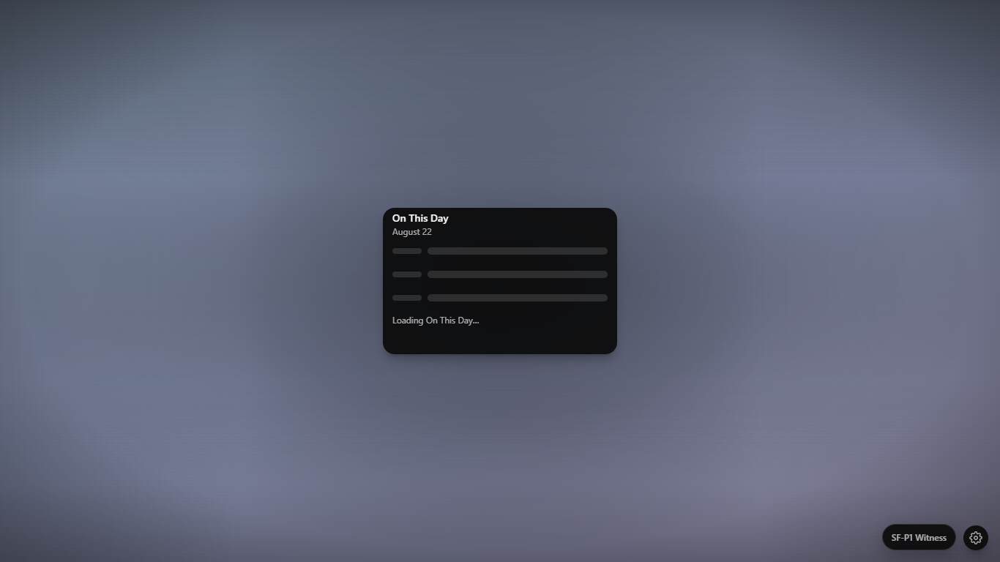 | onThisDay / state | standard / loading | dark | 1366x768 | 320.00x200.00 CSS px; client 318x198; scroll 318x198; overflow hidden/hidden | Loading On This Day… | State: loading | 12px / N/A: no focusable control in this state | None | None | **Useful**: The truthful onThisDay loading presentation remains readable and stable inside the selected standard frame. |
| 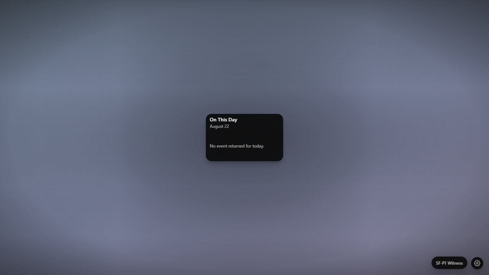 | onThisDay / state | compact / empty | dark | 1366x768 | 216.00x132.00 CSS px; client 214x130; scroll 214x130; overflow hidden/hidden | No event returned for today. | State: empty | 12px / N/A: no focusable control in this state | None | None | **Useful**: The truthful onThisDay empty presentation remains readable and stable inside the selected compact frame. |
| 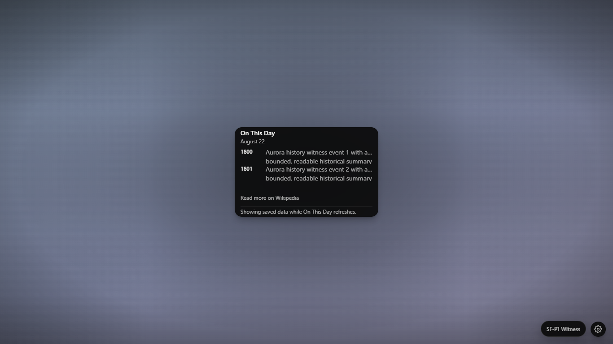 | onThisDay / state | standard / stale | dark | 1366x768 | 320.00x200.00 CSS px; client 318x198; scroll 318x198; overflow hidden/hidden | Showing saved data while On This Day refreshes. | 1800 Aurora history witness event 1 with a bounded, readable historical summary for the shared-frame witness. / 1801 Aurora history witness event 2 with a bounded, readable historical summary for the shared-frame witness. / 1802 Aurora history witness event 3 with a bounded, readable historical summary for the shared-frame witness. | 12px / Visible (Aurora history witness event 1 with a bounded, readable historical summary for the shared-frame witness.) | None | None | **Useful**: The truthful onThisDay stale presentation remains readable and stable inside the selected standard frame. |
| 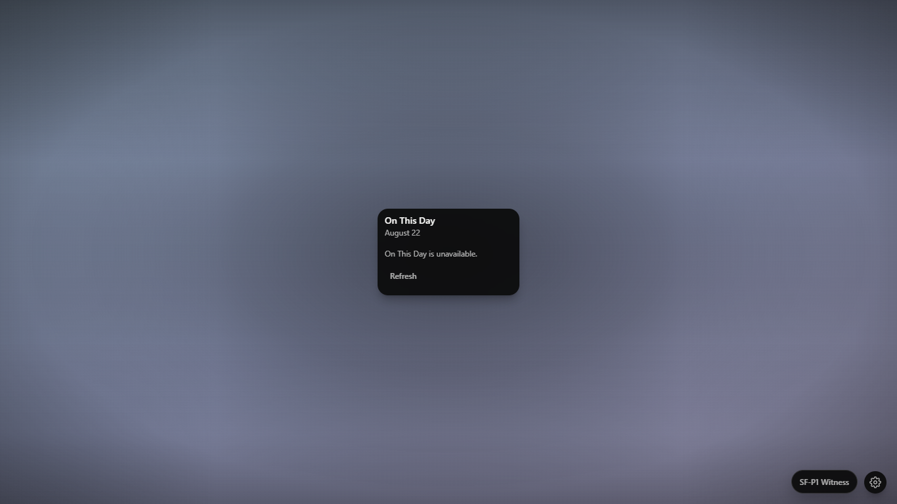 | onThisDay / state | compact / hard-error | dark | 1366x768 | 216.00x132.00 CSS px; client 214x130; scroll 214x130; overflow hidden/hidden | On This Day is unavailable. | Refresh | 12px / Visible (Refresh On This Day) | None | None | **Useful**: The truthful onThisDay hard-error presentation remains readable and stable inside the selected compact frame. |
| 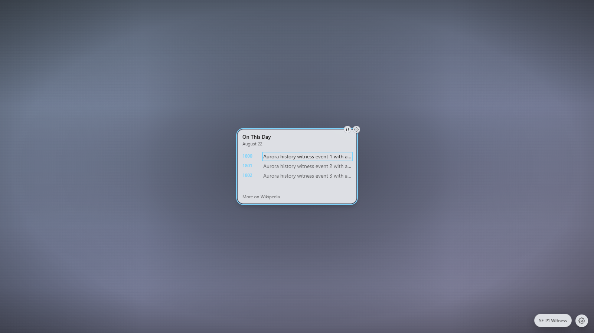 | onThisDay / theme | standard / ready | light | 1600x900 | 320.00x200.00 CSS px; client 318x198; scroll 318x198; overflow hidden/hidden | On This Day / August 22 / 1800 Aurora history witness event 1 with a bounded, readable historical summary for the shared-frame witness. / 1801 Aurora history witness event 2 with a bounded, readable historical summary for the shared-frame witness. / 1802 Aurora history witness event 3 with a bounded, readable historical summary for the shared-frame witness. | 1800 Aurora history witness event 1 with a bounded, readable historical summary for the shared-frame witness. 1801 Aurora history witness event 2 with a bounded, readable historical summary for the shared-frame witness. 1802 Aurora history witness event 3 with a bounded, readable historical summary for the shared-frame witness. | 12px / Visible (Aurora history witness event 1 with a bounded, readable historical summary for the shared-frame witness.) | None | None | **Useful**: The onThisDay Standard hierarchy and keyboard focus treatment remain clear on the light panel. |
| 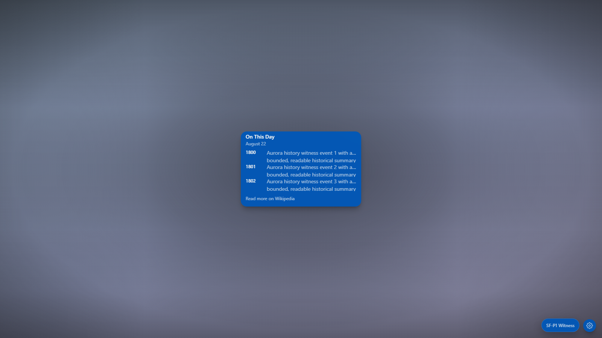 | onThisDay / theme | standard / ready | saturated | 1600x900 | 320.00x200.00 CSS px; client 318x198; scroll 318x198; overflow hidden/hidden | On This Day / August 22 / 1800 Aurora history witness event 1 with a bounded, readable historical summary for the shared-frame witness. / 1801 Aurora history witness event 2 with a bounded, readable historical summary for the shared-frame witness. / 1802 Aurora history witness event 3 with a bounded, readable historical summary for the shared-frame witness. | 1800 Aurora history witness event 1 with a bounded, readable historical summary for the shared-frame witness. 1801 Aurora history witness event 2 with a bounded, readable historical summary for the shared-frame witness. 1802 Aurora history witness event 3 with a bounded, readable historical summary for the shared-frame witness. | 12px / Visible (Aurora history witness event 1 with a bounded, readable historical summary for the shared-frame witness.) | None | None | **Useful**: The onThisDay Standard hierarchy and keyboard focus treatment remain clear on the saturated panel. |
| 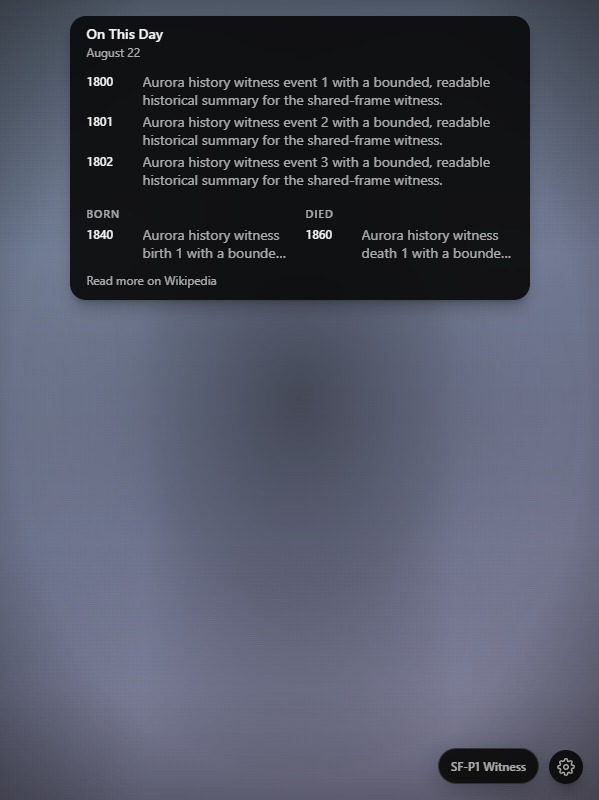 | onThisDay / narrow | full / ready | dark | 599x800 | 460.00x284.00 CSS px; client 458x282; scroll 458x282; overflow hidden/hidden | On This Day / August 22 / 1800 Aurora history witness event 1 with a bounded, readable historical summary for the shared-frame witness. / 1801 Aurora history witness event 2 with a bounded, readable historical summary for the shared-frame witness. / 1802 Aurora history witness event 3 with a bounded, readable historical summary for the shared-frame witness. / 1840 Aurora history witness birth 1 with a bounded, readable historical summary for the shared-frame witness. / 1860 Aurora history witness death 1 with a bounded, readable historical summary for the shared-frame witness. | 1800 Aurora history witness event 1 with a bounded, readable historical summary for the shared-frame witness. 1801 Aurora history witness event 2 with a bounded, readable historical summary for the shared-frame witness. 1802 Aurora history witness event 3 with a bounded, readable historical summary for the shared-frame witness. / 1840 Aurora history witness birth 1 with a bounded, readable historical summary for the shared-frame witness. / 1860 Aurora history witness death 1 with a bounded, readable historical summary for the shared-frame witness. | 11px / Visible (Aurora history witness event 1 with a bounded, readable historical summary for the shared-frame witness.) | None | None | **Useful**: The onThisDay Full frame remains exact, readable, and contained at the 599px narrow-floor boundary. |
|  | stack / stack | standard / ready | dark | 1408x445 | 320.00x200.00 CSS px; client 318x198; scroll 318x198; overflow hidden/hidden | 21° C / Partly cloudy - New York | Rain likely around 12 PM. | 12px / Visible (21°CPartly cloudy - New YorkRain likely around 12 PM.Feels22°Wind14 km/hHumidity60%) | None | None | **Useful**: The initial Weather face establishes the exact Standard stack footprint without a write. |
|  | stack / stack | standard / ready | dark | 1408x445 | 320.00x200.00 CSS px; client 318x198; scroll 318x198; overflow hidden/hidden | On This Day / August 22 / 1800 Aurora history witness event 1 with a bounded, readable historical summary for the shared-frame witness. / 1801 Aurora history witness event 2 with a bounded, readable historical summary for the shared-frame witness. / 1802 Aurora history witness event 3 with a bounded, readable historical summary for the shared-frame witness. | 1800 Aurora history witness event 1 with a bounded, readable historical summary for the shared-frame witness. 1801 Aurora history witness event 2 with a bounded, readable historical summary for the shared-frame witness. 1802 Aurora history witness event 3 with a bounded, readable historical summary for the shared-frame witness. | 12px / Visible (Aurora history witness event 1 with a bounded, readable historical summary for the shared-frame witness.) | None | layouts | **Useful**: Next pages to On This Day without moving or resizing the Standard stack. |
|  | stack / stack | standard / ready | dark | 1408x445 | 320.00x200.00 CSS px; client 318x198; scroll 318x198; overflow hidden/hidden | On This Day / August 22 / 1800 Aurora history witness event 1 with a bounded, readable historical summary for the shared-frame witness. / 1801 Aurora history witness event 2 with a bounded, readable historical summary for the shared-frame witness. / 1802 Aurora history witness event 3 with a bounded, readable historical summary for the shared-frame witness. | 1800 Aurora history witness event 1 with a bounded, readable historical summary for the shared-frame witness. 1801 Aurora history witness event 2 with a bounded, readable historical summary for the shared-frame witness. 1802 Aurora history witness event 3 with a bounded, readable historical summary for the shared-frame witness. | 12px / Visible (Aurora history witness event 1 with a bounded, readable historical summary for the shared-frame witness.) | None | layouts | **Useful**: Previous wraps to On This Day without moving or resizing the Standard stack. |
|  | stack / stack | standard / ready | dark | 1408x445 | 320.00x200.00 CSS px; client 318x198; scroll 318x198; overflow hidden/hidden | On This Day / August 22 / 1800 Aurora history witness event 1 with a bounded, readable historical summary for the shared-frame witness. / 1801 Aurora history witness event 2 with a bounded, readable historical summary for the shared-frame witness. / 1802 Aurora history witness event 3 with a bounded, readable historical summary for the shared-frame witness. | 1800 Aurora history witness event 1 with a bounded, readable historical summary for the shared-frame witness. 1801 Aurora history witness event 2 with a bounded, readable historical summary for the shared-frame witness. 1802 Aurora history witness event 3 with a bounded, readable historical summary for the shared-frame witness. | 12px / Visible (Aurora history witness event 1 with a bounded, readable historical summary for the shared-frame witness.) | None | layouts | **Useful**: The direct On This Day dot preserves the exact Standard stack footprint. |
|  | stack / stack | standard / ready | dark | 1408x445 | 320.00x200.00 CSS px; client 318x198; scroll 318x198; overflow hidden/hidden | On This Day / August 22 / 1800 Aurora history witness event 1 with a bounded, readable historical summary for the shared-frame witness. / 1801 Aurora history witness event 2 with a bounded, readable historical summary for the shared-frame witness. / 1802 Aurora history witness event 3 with a bounded, readable historical summary for the shared-frame witness. | 1800 Aurora history witness event 1 with a bounded, readable historical summary for the shared-frame witness. 1801 Aurora history witness event 2 with a bounded, readable historical summary for the shared-frame witness. 1802 Aurora history witness event 3 with a bounded, readable historical summary for the shared-frame witness. | 12px / Visible (Aurora history witness event 1 with a bounded, readable historical summary for the shared-frame witness.) | None | layouts | **Useful**: Swipe pages to On This Day with no selected text and no geometry shift. |
|  | stack / stack | standard / ready | dark | 1408x445 | 320.00x200.00 CSS px; client 318x198; scroll 318x198; overflow hidden/hidden | 21° C / Partly cloudy - New York | Rain likely around 12 PM. | 12px / Visible (21°CPartly cloudy - New YorkRain likely around 12 PM.Feels22°Wind14 km/hHumidity60%) | None | None | **Useful**: A plain Weather click opens the real viewport-owned details surface without selecting or paging the stack. |
