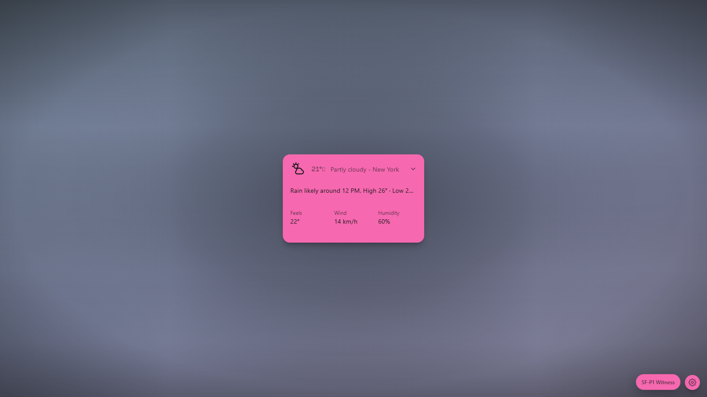
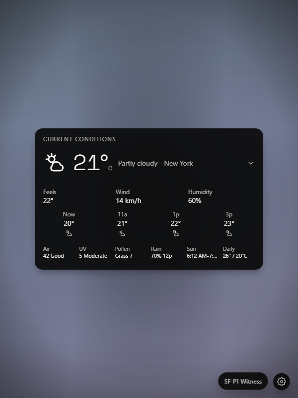
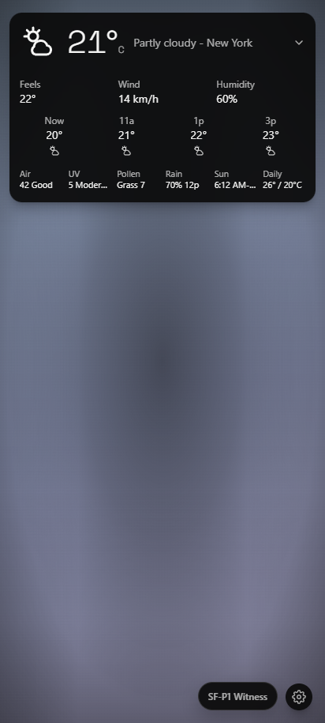
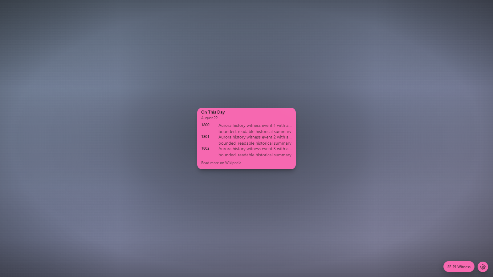
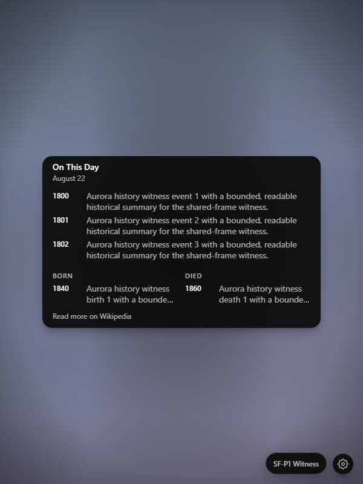
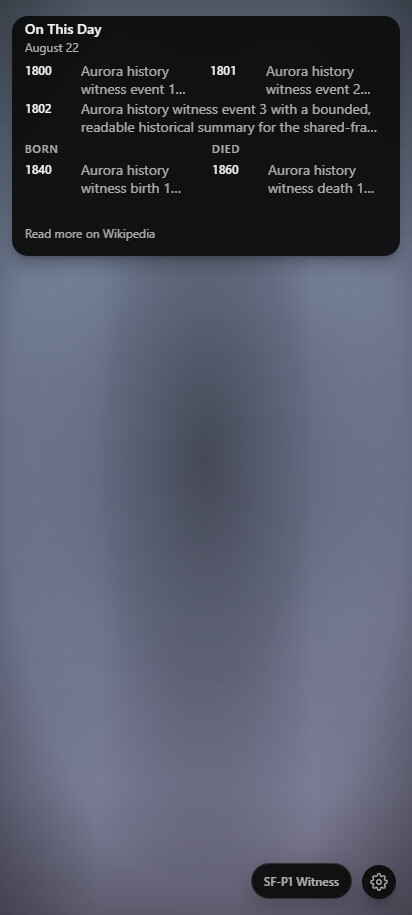
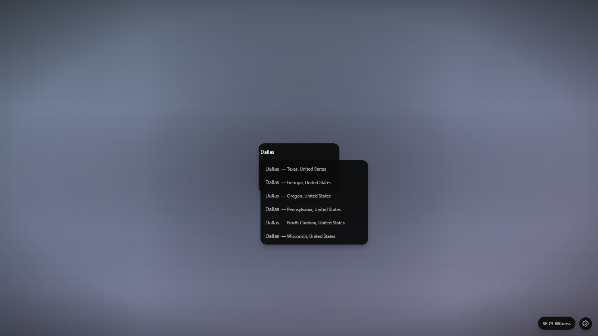
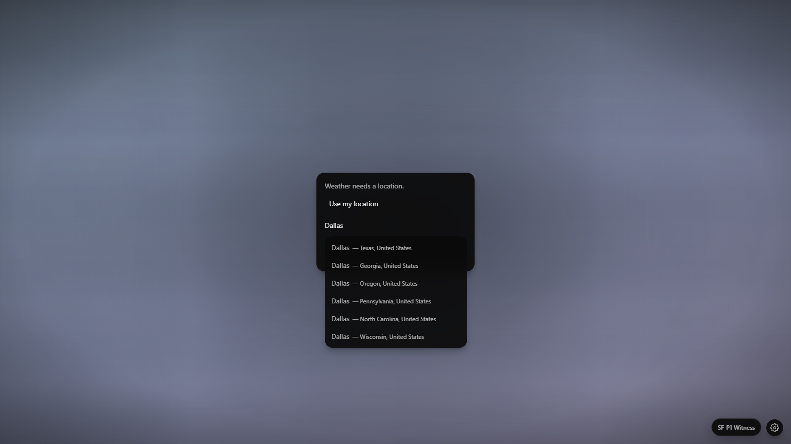

# SF-P1 Shared Frame Owner Catalog

- Reviewed product commit: `67168930d9a717129232375c5a5621bc5682f58c`
- Final loaded build commit: `62dacdd65e41f52a71cc273dc28bb6ca44cddbc2` (post-rereview harness-only correction)
- Evidence mode: final exact-build 36-capture catalog plus one headed `viewport:null` real-window witness.
- Browser: chromium 151.0.7922.34; Playwright Chromium; DPR 1; reduced motion
- Original-resolution captures: 36
- Verdicts: 36 Useful, 0 Needs refinement, 0 Rejected
- Verdicts are explicit per image and are not calculated from assertion status.

| Original PNG | Subject | Tier / state | Theme | Viewport | Measured frame and content geometry | Visible essential content | Visible signature content | Minimum text / focus | Selected text | Runtime storage writes | Usefulness verdict |
| --- | --- | --- | --- | --- | --- | --- | --- | --- | --- | --- | --- |
|  | weather / free-tier | compact / ready | dark | 1600x900 | 216.00x132.00 CSS px; client 214x130; scroll 214x130; overflow hidden/hidden | 21° C / Partly cloudy - New York | 21° C Partly cloudy - New York | 12px / Visible (21°CPartly cloudy - New YorkUpdated just now) | None | None | **Useful**: Compact Weather shows current conditions, location, and truthful freshness without dead space. |
|  | weather / free-tier | standard / ready | dark | 1600x900 | 320.00x200.00 CSS px; client 318x198; scroll 318x198; overflow hidden/hidden | 21° C / Partly cloudy - New York | Rain likely around 12 PM. | 12px / Visible (21°CPartly cloudy - New YorkRain likely around 12 PM.Feels22°Wind14 km/hHumidity60%) | None | None | **Useful**: Standard Weather uses the frame for trend and flat Feels, Wind, and Humidity facts. |
|  | weather / free-tier | full / ready | dark | 1600x900 | 460.00x284.00 CSS px; client 458x282; scroll 458x282; overflow hidden/hidden | 21° C / Partly cloudy - New York | Now 20° 11a 21° 1p 22° 3p 23° | 12px / Visible (Current conditions21°CPartly cloudy - New YorkRain likely around 12 PM.Feels22°Wind14 km/hHumidity60%Now20°11a21°1p22°3p23°) | None | None | **Useful**: Full Weather has a clear current-conditions hierarchy and a readable four-slot hourly signature. |
|  | weather / state | standard / loading | dark | 1366x768 | 320.00x200.00 CSS px; client 318x198; scroll 318x198; overflow hidden/hidden | Weather New York Loading weather… / Loading weather… | State: loading | 12px / N/A: no focusable control in this state | None | None | **Useful**: The authored loading state retains Weather and location context with a bounded skeleton. |
|  | weather / state | compact / empty | dark | 1366x768 | 216.00x132.00 CSS px; client 214x130; scroll 214x130; overflow hidden/hidden | Weather New York No data yet. Refresh / No data yet. | State: empty | 12px / Visible (Refresh) | None | None | **Useful**: The empty state identifies Weather, states that data is absent, and keeps Refresh available. |
|  | weather / state | full / stale | dark | 1366x768 | 460.00x284.00 CSS px; client 458x282; scroll 458x282; overflow hidden/hidden | Refreshing… | State: stale | 12px / Visible (Current conditions21°CPartly cloudy - New YorkRain likely around 12 PM.Feels22°Wind14 km/hHumidity60%Now20°11a21°1p22°3p23°Refreshing…) | None | None | **Useful**: Retained Weather remains informative while the compact refreshing status stays visible. |
|  | weather / state | standard / partial | dark | 1366x768 | 320.00x200.00 CSS px; client 318x198; scroll 318x198; overflow hidden/hidden | Weather details partially unavailable. | State: partial | 12px / Visible (21°CPartly cloudy - New YorkRain likely around 12 PM.Feels22°Wind14 km/hHumidity60%Weather details partially unavailable.) | None | None | **Useful**: Partial Weather preserves useful current facts and clearly discloses incomplete details. |
|  | weather / state | compact / permission-required | dark | 1366x768 | 216.00x132.00 CSS px; client 214x130; scroll 214x130; overflow hidden/hidden | Locate | State: permission-required | 14px / Visible (Use my location) | None | None | **Useful**: Compact setup keeps search and geolocation choices reachable inside the fixed frame. |
|  | weather / state | compact / hard-error | dark | 1366x768 | 216.00x132.00 CSS px; client 214x130; scroll 214x130; overflow hidden/hidden | Weather New York Weather unavailable. Try again. Refresh / Weather unavailable. Try again. | State: hard-error | 12px / Visible (Refresh) | None | None | **Useful**: The hard-error state is concise, recognizable, and retains the Refresh recovery action. |
|  | weather / theme | standard / ready | light | 1600x900 | 320.00x200.00 CSS px; client 318x198; scroll 318x198; overflow hidden/hidden | 21° C / Partly cloudy - New York | Rain likely around 12 PM. | 12px / Visible (21°CPartly cloudy - New YorkRain likely around 12 PM.Feels22°Wind14 km/hHumidity60%) | None | None | **Useful**: Adaptive dark ink keeps Standard Weather readable on the light panel. |
|  | weather / theme | standard / ready | saturated | 1600x900 | 320.00x200.00 CSS px; client 318x198; scroll 318x198; overflow hidden/hidden | 21° C / Partly cloudy - New York | Rain likely around 12 PM. | 12px / Visible (21°CPartly cloudy - New YorkRain likely around 12 PM.Feels22°Wind14 km/hHumidity60%) | None | None | **Useful**: Adaptive light ink keeps Standard Weather readable on saturated blue. |
|  | weather / theme | standard / ready | bright-pink | 1600x900 | 320.00x200.00 CSS px; client 318x198; scroll 318x198; overflow hidden/hidden | 21° C / Partly cloudy - New York | Rain likely around 12 PM. | 12px / Visible (21°CPartly cloudy - New YorkRain likely around 12 PM.Feels22°Wind14 km/hHumidity60%) | None | None | **Useful**: Adaptive dark ink keeps Standard Weather readable on the bright pink panel. |
|  | weather / narrow | full / ready | dark | 599x800 | 460.00x284.00 CSS px; client 458x282; scroll 458x282; overflow hidden/hidden | 21° C / Partly cloudy - New York | Now 20° 11a 21° 1p 22° 3p 23° | 12px / Visible (Current conditions21°CPartly cloudy - New YorkRain likely around 12 PM.Feels22°Wind14 km/hHumidity60%Now20°11a21°1p22°3p23°) | None | None | **Useful**: The Full Weather frame remains exact, complete, and balanced at the 600px planner side. |
|  | weather / planner-boundary | full / ready | dark | 600x800 | 460.00x284.00 CSS px; client 458x282; scroll 458x282; overflow hidden/hidden | 21° C / Partly cloudy - New York | Now 20° 11a 21° 1p 22° 3p 23° | 12px / Visible (Current conditions21°CPartly cloudy - New YorkRain likely around 12 PM.Feels22°Wind14 km/hHumidity60%Now20°11a21°1p22°3p23°) | None | None | **Useful**: The Full Weather frame remains exact and unchanged at the 599px planner side. |
|  | weather / narrow | full / ready | dark | 412x915 | 388.00x239.55 CSS px; client 386x238; scroll 386x238; overflow hidden/hidden | 21° C / Partly cloudy - New York | Now 20° 11a 21° 1p 22° 3p 23° | 12px / Visible (Current conditions21°CPartly cloudy - New YorkRain likely around 12 PM.Feels22°Wind14 km/hHumidity60%Now20°11a21°1p22°3p23°) | None | None | **Useful**: At 412px the Full tier scales proportionally while preserving current facts and four hours. |
|  | onThisDay / free-tier | compact / ready | dark | 1600x900 | 216.00x132.00 CSS px; client 214x130; scroll 214x130; overflow hidden/hidden | On This Day / August 22 / 1800 Aurora history witness event 1 with a bounded, readable historical summary for the shared-frame witness. | 1800 Aurora history witness event 1 with a bounded, readable historical summary for the shared-frame witness. | 12px / Visible (Aurora history witness event 1 with a bounded, readable historical summary for the shared-frame witness.) | None | None | **Useful**: Compact On This Day keeps one title, date, event, and provider destination legible. |
|  | onThisDay / free-tier | standard / ready | dark | 1600x900 | 320.00x200.00 CSS px; client 318x198; scroll 318x198; overflow hidden/hidden | On This Day / August 22 / 1800 Aurora history witness event 1 with a bounded, readable historical summary for the shared-frame witness. / 1801 Aurora history witness event 2 with a bounded, readable historical summary for the shared-frame witness. / 1802 Aurora history witness event 3 with a bounded, readable historical summary for the shared-frame witness. | 1800 Aurora history witness event 1 with a bounded, readable historical summary for the shared-frame witness. 1801 Aurora history witness event 2 with a bounded, readable historical summary for the shared-frame witness. 1802 Aurora history witness event 3 with a bounded, readable historical summary for the shared-frame witness. | 12px / Visible (Aurora history witness event 1 with a bounded, readable historical summary for the shared-frame witness.) | None | None | **Useful**: Standard On This Day presents three bounded events with useful two-line summaries. |
|  | onThisDay / free-tier | full / ready | dark | 1600x900 | 460.00x284.00 CSS px; client 458x282; scroll 458x282; overflow hidden/hidden | On This Day / August 22 / 1800 Aurora history witness event 1 with a bounded, readable historical summary for the shared-frame witness. / 1801 Aurora history witness event 2 with a bounded, readable historical summary for the shared-frame witness. / 1802 Aurora history witness event 3 with a bounded, readable historical summary for the shared-frame witness. / 1840 Aurora history witness birth 1 with a bounded, readable historical summary for the shared-frame witness. / 1860 Aurora history witness death 1 with a bounded, readable historical summary for the shared-frame witness. | 1800 Aurora history witness event 1 with a bounded, readable historical summary for the shared-frame witness. 1801 Aurora history witness event 2 with a bounded, readable historical summary for the shared-frame witness. 1802 Aurora history witness event 3 with a bounded, readable historical summary for the shared-frame witness. / 1840 Aurora history witness birth 1 with a bounded, readable historical summary for the shared-frame witness. / 1860 Aurora history witness death 1 with a bounded, readable historical summary for the shared-frame witness. | 11px / Visible (Aurora history witness event 1 with a bounded, readable historical summary for the shared-frame witness.) | None | None | **Useful**: Full On This Day uses its depth for events, one birth, one death, and the provider link. |
|  | onThisDay / state | standard / loading | dark | 1366x768 | 320.00x200.00 CSS px; client 318x198; scroll 318x198; overflow hidden/hidden | Loading On This Day… | State: loading | 12px / N/A: no focusable control in this state | None | None | **Useful**: The authored loading state keeps the title and date above a bounded event skeleton. |
|  | onThisDay / state | compact / empty | dark | 1366x768 | 216.00x132.00 CSS px; client 214x130; scroll 214x130; overflow hidden/hidden | No event returned for today. | State: empty | 12px / N/A: no focusable control in this state | None | None | **Useful**: The empty state preserves title and date context with a clear no-event message. |
|  | onThisDay / state | standard / stale | dark | 1366x768 | 320.00x200.00 CSS px; client 318x198; scroll 318x198; overflow hidden/hidden | Showing saved data while On This Day refreshes. | 1800 Aurora history witness event 1 with a bounded, readable historical summary for the shared-frame witness. / 1801 Aurora history witness event 2 with a bounded, readable historical summary for the shared-frame witness. | 12px / Visible (Aurora history witness event 1 with a bounded, readable historical summary for the shared-frame witness.) | None | None | **Useful**: Saved events and the stale-status copy remain visible together without internal scroll. |
|  | onThisDay / state | compact / hard-error | dark | 1366x768 | 216.00x132.00 CSS px; client 214x130; scroll 214x130; overflow hidden/hidden | On This Day is unavailable. | Refresh | 12px / Visible (Refresh On This Day) | None | None | **Useful**: The hard-error state keeps date context, an honest error, and the Refresh action. |
|  | onThisDay / theme | standard / ready | light | 1600x900 | 320.00x200.00 CSS px; client 318x198; scroll 318x198; overflow hidden/hidden | On This Day / August 22 / 1800 Aurora history witness event 1 with a bounded, readable historical summary for the shared-frame witness. / 1801 Aurora history witness event 2 with a bounded, readable historical summary for the shared-frame witness. / 1802 Aurora history witness event 3 with a bounded, readable historical summary for the shared-frame witness. | 1800 Aurora history witness event 1 with a bounded, readable historical summary for the shared-frame witness. 1801 Aurora history witness event 2 with a bounded, readable historical summary for the shared-frame witness. 1802 Aurora history witness event 3 with a bounded, readable historical summary for the shared-frame witness. | 12px / Visible (Aurora history witness event 1 with a bounded, readable historical summary for the shared-frame witness.) | None | None | **Useful**: Adaptive dark ink preserves the event hierarchy on the light panel. |
|  | onThisDay / theme | standard / ready | saturated | 1600x900 | 320.00x200.00 CSS px; client 318x198; scroll 318x198; overflow hidden/hidden | On This Day / August 22 / 1800 Aurora history witness event 1 with a bounded, readable historical summary for the shared-frame witness. / 1801 Aurora history witness event 2 with a bounded, readable historical summary for the shared-frame witness. / 1802 Aurora history witness event 3 with a bounded, readable historical summary for the shared-frame witness. | 1800 Aurora history witness event 1 with a bounded, readable historical summary for the shared-frame witness. 1801 Aurora history witness event 2 with a bounded, readable historical summary for the shared-frame witness. 1802 Aurora history witness event 3 with a bounded, readable historical summary for the shared-frame witness. | 12px / Visible (Aurora history witness event 1 with a bounded, readable historical summary for the shared-frame witness.) | None | None | **Useful**: Adaptive light ink preserves the event hierarchy on saturated blue. |
|  | onThisDay / theme | standard / ready | bright-pink | 1600x900 | 320.00x200.00 CSS px; client 318x198; scroll 318x198; overflow hidden/hidden | On This Day / August 22 / 1800 Aurora history witness event 1 with a bounded, readable historical summary for the shared-frame witness. / 1801 Aurora history witness event 2 with a bounded, readable historical summary for the shared-frame witness. / 1802 Aurora history witness event 3 with a bounded, readable historical summary for the shared-frame witness. | 1800 Aurora history witness event 1 with a bounded, readable historical summary for the shared-frame witness. 1801 Aurora history witness event 2 with a bounded, readable historical summary for the shared-frame witness. 1802 Aurora history witness event 3 with a bounded, readable historical summary for the shared-frame witness. | 12px / Visible (Aurora history witness event 1 with a bounded, readable historical summary for the shared-frame witness.) | None | None | **Useful**: Adaptive dark ink preserves the event hierarchy on the bright pink panel. |
|  | onThisDay / narrow | full / ready | dark | 599x800 | 460.00x284.00 CSS px; client 458x282; scroll 458x282; overflow hidden/hidden | On This Day / August 22 / 1800 Aurora history witness event 1 with a bounded, readable historical summary for the shared-frame witness. / 1801 Aurora history witness event 2 with a bounded, readable historical summary for the shared-frame witness. / 1802 Aurora history witness event 3 with a bounded, readable historical summary for the shared-frame witness. / 1840 Aurora history witness birth 1 with a bounded, readable historical summary for the shared-frame witness. / 1860 Aurora history witness death 1 with a bounded, readable historical summary for the shared-frame witness. | 1800 Aurora history witness event 1 with a bounded, readable historical summary for the shared-frame witness. 1801 Aurora history witness event 2 with a bounded, readable historical summary for the shared-frame witness. 1802 Aurora history witness event 3 with a bounded, readable historical summary for the shared-frame witness. / 1840 Aurora history witness birth 1 with a bounded, readable historical summary for the shared-frame witness. / 1860 Aurora history witness death 1 with a bounded, readable historical summary for the shared-frame witness. | 11px / Visible (Aurora history witness event 1 with a bounded, readable historical summary for the shared-frame witness.) | None | None | **Useful**: The Full historical layout remains complete and balanced at the 600px planner side. |
|  | onThisDay / planner-boundary | full / ready | dark | 600x800 | 460.00x284.00 CSS px; client 458x282; scroll 458x282; overflow hidden/hidden | On This Day / August 22 / 1800 Aurora history witness event 1 with a bounded, readable historical summary for the shared-frame witness. / 1801 Aurora history witness event 2 with a bounded, readable historical summary for the shared-frame witness. / 1802 Aurora history witness event 3 with a bounded, readable historical summary for the shared-frame witness. / 1840 Aurora history witness birth 1 with a bounded, readable historical summary for the shared-frame witness. / 1860 Aurora history witness death 1 with a bounded, readable historical summary for the shared-frame witness. | 1800 Aurora history witness event 1 with a bounded, readable historical summary for the shared-frame witness. 1801 Aurora history witness event 2 with a bounded, readable historical summary for the shared-frame witness. 1802 Aurora history witness event 3 with a bounded, readable historical summary for the shared-frame witness. / 1840 Aurora history witness birth 1 with a bounded, readable historical summary for the shared-frame witness. / 1860 Aurora history witness death 1 with a bounded, readable historical summary for the shared-frame witness. | 11px / Visible (Aurora history witness event 1 with a bounded, readable historical summary for the shared-frame witness.) | None | None | **Useful**: The Full historical layout stays exact and complete at the 599px planner side. |
|  | onThisDay / narrow | full / ready | dark | 412x915 | 388.00x239.55 CSS px; client 386x238; scroll 386x238; overflow hidden/hidden | On This Day / August 22 / 1800 Aurora history witness event 1 with a bounded, readable historical summary for the shared-frame witness. / 1801 Aurora history witness event 2 with a bounded, readable historical summary for the shared-frame witness. / 1802 Aurora history witness event 3 with a bounded, readable historical summary for the shared-frame witness. / 1840 Aurora history witness birth 1 with a bounded, readable historical summary for the shared-frame witness. / 1860 Aurora history witness death 1 with a bounded, readable historical summary for the shared-frame witness. | 1800 Aurora history witness event 1 with a bounded, readable historical summary for the shared-frame witness. 1801 Aurora history witness event 2 with a bounded, readable historical summary for the shared-frame witness. 1802 Aurora history witness event 3 with a bounded, readable historical summary for the shared-frame witness. / 1840 Aurora history witness birth 1 with a bounded, readable historical summary for the shared-frame witness. / 1860 Aurora history witness death 1 with a bounded, readable historical summary for the shared-frame witness. | 11px / Visible (Aurora history witness event 1 with a bounded, readable historical summary for the shared-frame witness.) | None | None | **Useful**: At 412px the proportional Full frame keeps all required event and provider categories. |
|  | stack / stack | standard / ready | dark | 1408x445 | 320.00x200.00 CSS px; client 318x198; scroll 318x198; overflow hidden/hidden | 21° C / Partly cloudy - New York | Rain likely around 12 PM. | 12px / Visible (21°CPartly cloudy - New YorkRain likely around 12 PM.Feels22°Wind14 km/hHumidity60%) | None | None | **Useful**: The initial stack face is bounded and its controls stay compact around the framed widget. |
|  | stack / stack | standard / ready | dark | 1408x445 | 320.00x200.00 CSS px; client 318x198; scroll 318x198; overflow hidden/hidden | On This Day / August 22 / 1800 Aurora history witness event 1 with a bounded, readable historical summary for the shared-frame witness. / 1801 Aurora history witness event 2 with a bounded, readable historical summary for the shared-frame witness. / 1802 Aurora history witness event 3 with a bounded, readable historical summary for the shared-frame witness. | 1800 Aurora history witness event 1 with a bounded, readable historical summary for the shared-frame witness. 1801 Aurora history witness event 2 with a bounded, readable historical summary for the shared-frame witness. 1802 Aurora history witness event 3 with a bounded, readable historical summary for the shared-frame witness. | 12px / Visible (Aurora history witness event 1 with a bounded, readable historical summary for the shared-frame witness.) | None | layouts | **Useful**: Next navigation changes only the visible face and leaves the stack composition coherent. |
|  | stack / stack | standard / ready | dark | 1408x445 | 320.00x200.00 CSS px; client 318x198; scroll 318x198; overflow hidden/hidden | On This Day / August 22 / 1800 Aurora history witness event 1 with a bounded, readable historical summary for the shared-frame witness. / 1801 Aurora history witness event 2 with a bounded, readable historical summary for the shared-frame witness. / 1802 Aurora history witness event 3 with a bounded, readable historical summary for the shared-frame witness. | 1800 Aurora history witness event 1 with a bounded, readable historical summary for the shared-frame witness. 1801 Aurora history witness event 2 with a bounded, readable historical summary for the shared-frame witness. 1802 Aurora history witness event 3 with a bounded, readable historical summary for the shared-frame witness. | 12px / Visible (Aurora history witness event 1 with a bounded, readable historical summary for the shared-frame witness.) | None | layouts | **Useful**: Previous navigation returns coherently with readable arrows and position dots. |
|  | stack / stack | standard / ready | dark | 1408x445 | 320.00x200.00 CSS px; client 318x198; scroll 318x198; overflow hidden/hidden | On This Day / August 22 / 1800 Aurora history witness event 1 with a bounded, readable historical summary for the shared-frame witness. / 1801 Aurora history witness event 2 with a bounded, readable historical summary for the shared-frame witness. / 1802 Aurora history witness event 3 with a bounded, readable historical summary for the shared-frame witness. | 1800 Aurora history witness event 1 with a bounded, readable historical summary for the shared-frame witness. 1801 Aurora history witness event 2 with a bounded, readable historical summary for the shared-frame witness. 1802 Aurora history witness event 3 with a bounded, readable historical summary for the shared-frame witness. | 12px / Visible (Aurora history witness event 1 with a bounded, readable historical summary for the shared-frame witness.) | None | layouts | **Useful**: Direct dot navigation exposes a clear active position without adding heavy chrome. |
|  | stack / stack | standard / ready | dark | 1408x445 | 320.00x200.00 CSS px; client 318x198; scroll 318x198; overflow hidden/hidden | On This Day / August 22 / 1800 Aurora history witness event 1 with a bounded, readable historical summary for the shared-frame witness. / 1801 Aurora history witness event 2 with a bounded, readable historical summary for the shared-frame witness. / 1802 Aurora history witness event 3 with a bounded, readable historical summary for the shared-frame witness. | 1800 Aurora history witness event 1 with a bounded, readable historical summary for the shared-frame witness. 1801 Aurora history witness event 2 with a bounded, readable historical summary for the shared-frame witness. 1802 Aurora history witness event 3 with a bounded, readable historical summary for the shared-frame witness. | 12px / Visible (Aurora history witness event 1 with a bounded, readable historical summary for the shared-frame witness.) | None | layouts | **Useful**: Swipe navigation reaches the intended face while retaining the exact stack bounds. |
|  | stack / stack | standard / ready | dark | 1408x445 | 320.00x200.00 CSS px; client 318x198; scroll 318x198; overflow hidden/hidden | 21° C / Partly cloudy - New York | Rain likely around 12 PM. | 12px / Visible (21°CPartly cloudy - New YorkRain likely around 12 PM.Feels22°Wind14 km/hHumidity60%) | None | None | **Useful**: A plain Weather click reaches the existing detail destination instead of selecting the stack. |
|  | weather / location | compact / permission-required | dark | 1600x900 | 216.00x132.00 CSS px; client 214x130; scroll 214x130; overflow hidden/hidden | Locate | State: permission-required | 14px / Visible (Use my location) | None | None | **Useful**: The Compact listbox visibly escapes frame clipping and presents six reachable results. |
|  | weather / location | standard / permission-required | dark | 1600x900 | 320.00x200.00 CSS px; client 318x198; scroll 318x198; overflow hidden/hidden | Weather needs a location. Use my location | State: permission-required | 14px / Visible (Use my location) | None | None | **Useful**: The Standard listbox is cleanly anchored outside the frame and keeps setup context visible. |
