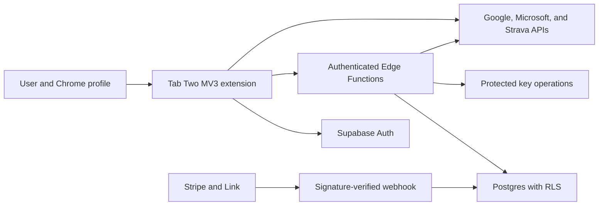

# Tab Two Paid MVP Threat Model

**Date:** 2026-08-31
**Status:** Owner-approved consolidated security direction; implementation not started
**Authority:** `2026-08-31-tab-two-freemium-product-architecture-design.md`

## Purpose

This threat model defines the security boundaries that the paid MVP must meet
before infrastructure or production implementation is approved. It covers
Google account authentication, Stripe Managed Payments, signed entitlements,
complimentary owner access, devices, encrypted sync, aggregate metrics,
premium connector OAuth, Supabase, diagnostics, and deletion.

It does not authorize provisioning, production secrets, new extension
permissions, deployment, publication, or Chrome Web Store changes.

## Security objectives

1. Free local use remains available without a Tab Two account or backend call.
2. A customer can access only their own account, devices, entitlement, vault,
   metrics, and connector metadata.
3. Connector credentials, capability URLs, raw provider payloads, and custom
   images never enter the sync vault.
4. Stripe, Supabase, provider, and key-management secrets never enter the
   extension bundle, logs, backups, diagnostics, or screenshots.
5. A failed, stale, malicious, or revoked device cannot silently corrupt or
   resurrect newer local data.
6. Billing failure never disables existing free behavior.
7. The owner can always exercise premium through a server-issued complimentary
   grant without creating a production client-side bypass.
8. Destructive account, vault, device, and history actions are explicit,
   authenticated, auditable, and recoverable only where the product promises.

## Trust boundaries

- The Chrome profile is trusted to the same degree as today's local connector
  credential model. Malware, a compromised operating-system account, or an
  unlocked shared profile can read local extension state.
- Extension code is unprivileged. It may hold a Supabase session, signed
  entitlement lease, local connector token, and ciphertext, but never a Stripe
  secret, Supabase secret key, provider client secret, account key-encryption
  key, or service-role credential.
- Client-reachable Postgres objects are default-deny. Grants and RLS are both
  required; either one alone is insufficient.
- Privileged Edge Functions form the only boundary for Stripe webhooks, owner
  grants, account-key release, account deletion, and any provider flow that
  requires a client secret.

## Protected assets and classification

| Asset | Location | Classification | Backup or sync rule |
|---|---|---|---|
| Supabase refresh and access session | `chrome.storage.local` through one typed adapter | Authentication secret | Excluded from JSON backup, sync, diagnostics, logs, and screenshots |
| Signed entitlement lease | Local extension storage | Integrity-sensitive, not a bearer secret | Excluded from JSON backup and sync; signature and expiry validated before use |
| Complimentary owner grant | Postgres | Privileged authorization record | Server-only mutation; audit event required |
| Stripe customer/subscription identifiers | Postgres | Account metadata | Never exposed beyond the owning account except privileged webhook processing |
| Stripe webhook and API secrets | Supabase secret storage | Critical secret | Never returned to the extension or written to logs |
| Account data-encryption key | Released only after authenticated authorization | Critical secret | Wrapped at rest; never logged or included in diagnostics |
| Encrypted vault | Postgres and local sync cache | Confidential ciphertext | Exportable as ciphertext; maximum 2 MB |
| Connector tokens and capability URLs | Existing local connector authority | Authentication or capability secret | Never synced; redacted from JSON backup and diagnostics |
| Aggregate metric buckets | Local storage and encrypted vault | Private user data | Synced only through the typed allowlist; 13-month maximum |
| Device identifier and friendly name | Local storage and Postgres | Account metadata | Random identifier only; no hardware fingerprint |

## Adversaries and failure actors

- An unauthenticated internet client probing Supabase or Edge Functions.
- An authenticated customer attempting to read or mutate another account.
- A malicious extension page script created by an XSS or dependency compromise.
- A stolen Supabase session or local connector token.
- A forged, replayed, duplicated, delayed, or out-of-order Stripe webhook.
- A stale or revoked device uploading old state or resurrecting tombstones.
- A malformed sync document attempting to smuggle a secret-classified field.
- A provider, network, or backend outage producing partial or reordered work.
- An accidental owner operation, leaked server secret, or overly broad RLS grant.
- Automated abuse intended to consume MAU, Function, database, or egress quota.

## Required controls

### Authentication and sessions

- Google sign-in is explicit and begins only from the Account & Sync surface.
- Signing in checks account and entitlement state only. Sync remains a separate
  explicit opt-in and sign-in alone uploads no local product data.
- OAuth uses PKCE, a cryptographically random state value, an exact redirect
  allowlist, short-lived authorization codes, and single-use callback state.
- Development, staging, and production use separate Google projects and
  redirect registrations.
- The extension stores the minimum Supabase session needed for refresh in one
  typed local adapter. Sign-out deletes it and invalidates the server session.
- Session values are excluded by construction from backup, sync, diagnostics,
  application logs, error payloads, and UI rendering.

### Entitlements and owner access

- A signed lease includes account UUID, grant source, capabilities, issued-at,
  expiry, lease version, and unique identifier.
- The backend calculates effective access from active grants. Supported sources
  are `stripe` and `complimentary_owner`; the extension cannot create either.
- The owner grant is inserted only after the owner first signs in and the exact
  Supabase/Tab Two account UUID is confirmed through a privileged operation.
- No production code compares an email address, Chrome profile, build user, or
  local flag to grant premium.
- Preview entitlement fixtures compile only in preview mode. A production bundle
  scan rejects fixture names, test signing material, and entitlement overrides.
- Owner-access tests cancel or expire the Stripe grant and prove the signed
  complimentary grant still authorizes every premium capability.

### Billing and webhooks

- Stripe signatures are verified from the unmodified request body before JSON
  parsing or database work.
- An idempotency table records Stripe event id, type, object id, creation time,
  processing result, and processed time. Duplicate delivery is identity.
- Subscription state is derived from authoritative Stripe objects, not event
  arrival order. A later delivery of an older event cannot roll back access.
- Introductory pricing redemption is enforced against both the Tab Two account
  and associated Stripe customer.
- Checkout and portal sessions are created only by authenticated functions for
  the requesting account. Client-supplied price, customer, entitlement, or
  redirect authorities are rejected.

### Database and privileged functions

- Every client-reachable table has explicit grants, RLS enabled, and default-deny
  policies keyed to the authenticated account UUID.
- SQL tests attempt cross-account select, insert, update, delete, function call,
  and view access. Every attempt must fail.
- The secret or service-role key exists only in protected functions. Browser
  code uses a publishable key and a user JWT.
- Owner grants, key release, account deletion, and webhook processing require
  dedicated privileged functions with narrow input schemas and audit events.
- Logs contain stable error codes and correlation ids, never tokens, payloads,
  event text, task text, repository names, routes, or plaintext vault content.

### Encryption and sync

- Each account has a random 256-bit data-encryption key. Vault encryption uses
  AES-256-GCM with a unique 96-bit nonce per ciphertext and authenticated
  version/account metadata.
- The data key is wrapped by a versioned server-held key-encryption key. Routine
  rotation rewraps the data key; suspected data-key compromise creates a new
  data key and re-encrypts the vault.
- The backend can release the data key after authentication and authorization;
  therefore the product says encrypted sync, never zero knowledge or end-to-end
  encrypted sync.
- One typed deny-by-default serializer admits only approved settings, text,
  stable ids, revisions, tombstones, and aggregate metric buckets. Unknown
  fields fail closed.
- Exhaustive fixtures include every connector secret, nested RSS/ICS capability
  URL, Supabase session, signed lease, provider token, cache, raw response, and
  photo/blob field and prove that none can serialize.
- Uploads use optimistic server versions. A stale upload is rejected rather
  than overwriting the current server record. The latest server-accepted
  same-record revision wins without trusting device clocks; the client first
  backs up its unsynced local version and then adopts the server revision
  without automatically retrying the stale change. Deletions use acknowledged
  tombstones; failed sync never replaces valid local state.

### Devices, deletion, and diagnostics

- Device ids are random and independent of hardware. Revocation blocks future
  server access but does not claim to erase the device's existing local data.
- Device-limit replacement requires fresh account authentication and an
  explicit selected device; requests cannot revoke an arbitrary foreign id.
- A sixth installation may sign in and use local features, but cannot activate
  sync until the customer explicitly revokes an active installation. No device
  is auto-evicted.
- Vault deletion and account deletion require fresh authentication, explicit
  confirmation, idempotent backend jobs, and an owner-visible final state.
- User-generated diagnostics are assembled locally, shown for review, and sent
  only through an explicit user action. Redaction tests use realistic tokens,
  nested URLs, event/task text, and provider payloads.

### Availability and cost abuse

- Authentication, key release, sync, checkout, deletion, and provider exchange
  endpoints have per-account and per-IP limits with bounded payload sizes.
- The 2 MB vault and five-device limits are enforced server-side and repeated
  client-side only for early feedback.
- Supabase's spend cap remains enabled, but owner monitoring also covers compute
  and other items the cap does not protect.
- Provider refresh work uses the established visible-tab Web Lock ownership,
  conditional versions, backoff, and explicit Manual mode.

## Risk register

| Threat | Severity | Required verification | Residual boundary |
|---|---|---|---|
| Cross-account RLS or view exposure | Critical | Automated SQL adversary matrix plus authenticated integration tests | Supabase/operator compromise remains a service risk |
| Secret enters sync, backup, diagnostics, or logs | Critical | Exhaustive deny-list fixtures and production artifact scans | A compromised local OS profile can read local secrets |
| Forged entitlement or client-side owner bypass | Critical | Signature, account binding, production symbol scan, and tamper tests | Privileged backend operators can grant access |
| Webhook forgery, replay, or stale rollback | Critical | Signature, raw-body, idempotency, reordering, and recovery tests | Stripe outage delays current billing state |
| Lost or resurrected sync data | Important | Concurrent entity, pre-overwrite local-backup, tombstone, revoked-device, and rollback tests | The latest server-accepted same-record revision wins; the displaced local state remains recoverable through a local backup |
| OAuth CSRF, redirect substitution, or token leak | Critical | PKCE/state/replay/redirect and log-redaction tests | Provider or browser account compromise remains external |
| Owner locked out by Stripe state | Important | Complimentary grant remains active through cancel, fail, refund, and webhook delay | Google/Tab Two account loss still requires account recovery |
| Cost exhaustion or abusive requests | Important | Quota, rate-limit, payload-size, spend-alert, and failure-mode tests | Spend cap does not cover every Supabase charge |
| Misleading deletion or device-revocation copy | Important | UI, API, retention, and manual-device verification | Remote deletion cannot erase offline local storage |

## Delivery ownership, tests, and rollback

| Packet | Implementation authority | Required gate | Rollback boundary |
|---|---|---|---|
| Free-baseline hardening | Extension repository | Focused tests, full gate, exact build, connector/layout/drag Chromium | Revert packet; no data migration or backend state |
| Account and entitlement client | Extension repository | Session redaction, lease tamper, preview isolation, signed-out/offline UI | Feature adapter disabled; existing free product remains |
| Supabase foundation | Versioned SQL and Edge Functions | Local Supabase tests, RLS adversary matrix, secret scan, backup restore drill | Forward SQL migration or isolated project restore |
| Stripe billing | Edge Functions and Stripe sandbox | Signature, replay, ordering, lifecycle, owner-grant, and portal tests | Disable checkout creation; preserve last valid signed leases |
| Encrypted sync | Extension plus Edge Functions | Crypto vectors, allowlist, conflicts, tombstones, devices, 2 MB quota | Stop sync traffic; local data remains authoritative |
| Metrics | Extension plus encrypted vault | Aggregate-only schema, retention, deletion, merge, and widget QA | Disable aggregation; preserve or export existing local buckets |
| Premium connectors | Individual provider adapters | Scope, token, quota, refresh, privacy, disconnect, and Chromium gates | Disable one provider without affecting account or free connectors |
| Paid release | Exact production artifact | Full-product QA and owner MacBook smoke test | No rollout or Store mutation without separate approval |

## Incident and recovery requirements

- Maintain an owner-only runbook for revoking Supabase, Stripe, Google,
  Microsoft, and Strava secrets; rotating the account key-encryption key;
  disabling checkout; disabling one connector; and invalidating all sessions.
- Security, privacy, deletion, quota, webhook, provider, and spend alerts reach
  the monitored owner alias.
- A suspected client bundle compromise stops premium rollout, revokes sessions
  and provider tokens where required, rotates server secrets, and produces a
  new signed build. Free local data is never remotely erased as containment.
- Backup restoration is rehearsed before launch. A restore never bypasses RLS,
  account binding, tombstone state, or entitlement authority.

## Approval gates still required

- Exact account and connector OAuth registrations and scopes.
- Addition of the Chrome `identity` permission and any provider host authority.
- Supabase and Stripe provisioning or production secret creation.
- Account & Sync, Metrics, billing, device, conflict, deletion, and premium
  connector visual approval.
- Production deployment, Chrome Web Store mutation, rollout, or publication.
